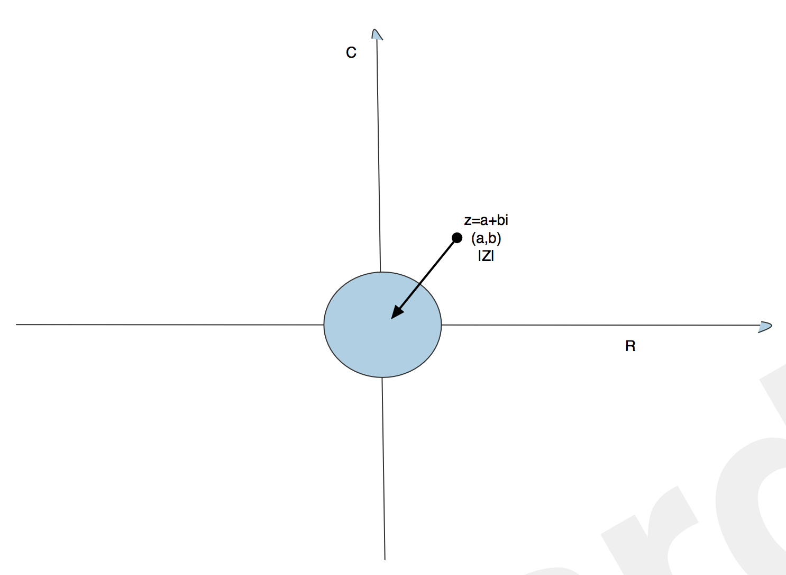

```{r setup, include=FALSE}
knitr::opts_chunk$set(echo = TRUE)
```

## Recap:

+ $\{Y_t\} \sim AR(p)$ if 

>> $Y_t = \phi_1Y_{t-1}+\phi_2Y_{t-2}+...+\phi_pY_{t-p}+\epsilon_t$

>>$\phi(B)Y_t = \epsilon_t$

>>where $\phi(Z) = 1- \phi_1Z-\phi_2Z^2-...-\phi_pZ^p$

+ {$Y_t$} ~ $\sim MA(q)$ if 

>>$Y_t = \epsilon_t+\theta_1\epsilon_{t-1}+\theta_2\epsilon_{t-2}+...+\theta_q\epsilon_{t-q}$

>>$Y_t = \theta(B)\epsilon_t$

>>where $\theta(Z) = 1+\theta_1Z+\theta_2Z^2+...+\theta_qZ^q$

+ $\phi(Z)$ and $\theta(Z)$ are **"generating functions"** AKA **"characteristic polynomials"**

## Mathematical Prerequisites

A **power series** is an infinite sum representation of a function

$f(x)=\sum_{n=0}^\infty a_nx^n$

+ EX1:

> $e^x=sum_{n=0}^\infty \frac{x^n}{n!}$ (exponential series)

+ EX2:

> $\frac{1}{1-x}=\sum_{n=0}^\infty x^n$ (geometric series) Converges if |x|<1

+ EX3:

> $f(x)=\sum_{n=0}^\infty \frac{f^(n)(a)(x-a)^n}{n!}$ (Taylor Series)

+ EX4:

> $\frac{1}{1-x+x^2-2x^3}=\frac{1}{1-(x-x^2+2x^3)}=\sum_{n=0}^\infty (x-x^2+2x^3)^n$ converage if  $|x-x^2+2x^3|<1$

## Complex Numbers:

$\sqrt{-1}\equiv i$ (imaginery number)

A **complex number** can be generally written as:

$Z=a+bi \in C$ where $a,b\in R$, a is the real part and $bi$ is the complex part.

(there is a graph)
```{r pressure, echo=FALSE, fig.cap="A caption", out.width = '100%'}

```

+ |Z| > 1 implies that Z lies outside the unite circle
+ |Z| $\le$ 1 implies that Z lies on/insideside the unite circle

## Remarks

+ MA(q) is stationary for all q 

+ $AR(p) =MA(\infty)$ if "stationary conditions" hold

+ $MA(q) = AR(\infty)$ if "invertibility conditions" hold

## Stationarity Conditions

we know $\phi(B)Y_t=\epsilon_t$, $Y_t=\frac{1}{\phi(B)}\epsilon_t$  (1) (inverse the function)

because any function has a powerseries representation we know 

$\frac{1}{\phi(B)}=\sum_{n=0}^{\infty} \psi_nB^n = \psi_0+\psi_1 B+\psi_2 B^2+... \equiv \psi(B)$

let's substitute this into equation(1)

\begin{center}
$Y_t=\psi(B)\epsilon_t$

$=(\psi_0+\psi_1 B+\psi_2 B^2+...)\epsilon_t$

$=\psi_0\epsilon_t+\psi_1\epsilon_{t-1}+\psi_2\epsilon_{t-2}+\psi_3\epsilon_{t-3}+...$

\end{center}
if $\psi_0=1$, this looks like $MA(\infty)$.

In order for this to be useful, we require that $\psi_0\epsilon_t+\psi_1\epsilon_{t-1}+\psi_2\epsilon_{t-2}+\psi_3\epsilon_{t-3}+...$ converges. This converges if $\sum_{n=0}^{\infty}\psi_nZ^n$ converges which happens if and only if the zeros(roots) of $\psi(Z)$ lie outside the unit circle in the complex plane.

Thus, an AR(p) model can be written as an $MA(\infty)$ model is $\phi(Z)$ \, the AR generating function, has zeros outside the unit circle in the complex plane.
\begin{center}
$\phi(z)\neq 0 $ for any Z such that $|Z|\le1$
\end{center}
or equivalently $\phi(Z)=0$ only for Z such that $|Z|>1$ (stationary condition)

## Invertibility Conditions

We know $Y_t=\theta(B)\epsilon_t$ if $\{Y_t\} \sim MA(q)$   

$\frac{1}{\theta(B)} Y_t = \epsilon_t$    (2)

Because any function has a power series representation we know

$\frac{1}{\theta(B)}=\sum_{n=0}^{\infty}\lambda_nB^n=\lambda_0+\lambda_1B+\lambda_2B^2=...\equiv\lambda(B)$

substituting this into equation(2) yields:
\begin{center}
$\lambda(B)Y_t=\epsilon_t$

$(\lambda_0+\lambda_1B+\lambda_2B^2+...)Y_t=\epsilon_t$

$\lambda_0Y_t+\lambda_1Y_{t-1}+\lambda_2Y_{t-2}+...=\epsilon_t$
\end{center}
if $\lambda_0=1$, this looks like $AR(\infty)$

Inorder for this to be useful we require $\lambda_0Y_t+\lambda_1Y_{t-1}+\lambda_2Y_{t-2}+...$ to converge which happens if and only if the zeros of $\theta(Z)$ lie outside the unit circle in the complex plane.

Thus an MA(q) model is invertible iff:
\begin{center}
$\theta(z)\neq0$ for any Z such that $|Z| \le 1$
\end{center}
or equivelently $\theta(Z)=0$ only for z such that |Z| > 1


## Consequences of:

+ AR(p) = MA($\infty$) 

=> ACF of an AR(p) process shows exponential decay because the ACF for MA(q) "Shuts off" for h>q. But here q = $\infty$ and so AR(p) does not "Shut off" on an ACF

+ MA(q) = AR($\infty$)

=> PACF of MA(q) shows exponential decay because the PACF for AR(p) "Shuts off" for h>p. But here p=$\infty$, so MA(q) doesn't "shut off" on a PACF plot.

### Example1:

suppose $\{Y_t\}\sim AR(2)$ with $Y_t=0.75Y_{t-1}-0.5625Y_{t-2}+\epsilon_t$, is $\{Y_t\}$ stationary?

answer: 

$Y_t-0.75Y_{t-1}+0.5625Y_{t-2}=\epsilon_t$

$Y_t-0.75BY_{t}+0.5625B^2Y_{t}=\epsilon_t$

$(1-0.75B+0.5625B^2)Y_{t}=\epsilon_t$

$\phi(z)=1-0.75z+0.5625z^2$

for what values of z does $\phi(z)=0$

Aside: $ax^2+bx+c=0$ if $x = \frac{-b\pm\sqrt{b^2-4ac}}{2a}$

$\phi(z)=0$ if $z = \frac{0.75\pm\sqrt{(-0.75)^2-4\times 0.5625}}{2\times 0.5625}$

$=\frac{2\pm2\sqrt{-3}}{3} = \frac{2}{3}\pm\frac{2\sqrt{3}i}{3}$

Our zeros are 

$Z_1 = \frac{2}{3}+\frac{2\sqrt{3}i}{3}$ 

>> => $|z_1|=\sqrt{(\frac{2}{3})^2+(\frac{-2\sqrt{3}}{3})^2}=\frac{4}{3}$

$Z_2 = \frac{2}{3}2\frac{2\sqrt{3}i}{3}$ 

>> => $|z_2|=\sqrt{(\frac{2}{3})^2+(\frac{-2\sqrt{3}}{3})^2}==\frac{4}{3}$

since $\frac{4}{3}>1$, $\{Y_t\}$ is stationary

### Example2:

Suppose $\{Y_t\}$ is MA(1) with 

$Y_t =\epsilon_t+1.25\epsilon_{t-1}$ is $\{Y_t\}$ invertible?

answer: $Y_t = \epsilon_t+1.25B\epsilon_t$

$=(1+1.25B)\epsilon_t$

Thus, $\theta(z)=1+1.25z$

for what values of z is $\theta(z)=0$?

$1+1.25z=0$ => $z=\frac{-1}{1.25}=-0.8$

the zero of $\theta(z)$ is :

$z=-0.8$ => $|z|=\sqrt{(-0.8)^2+0^2} = 0.8 < 1$

$\therefore \{Y_t\}$ is not invertible.